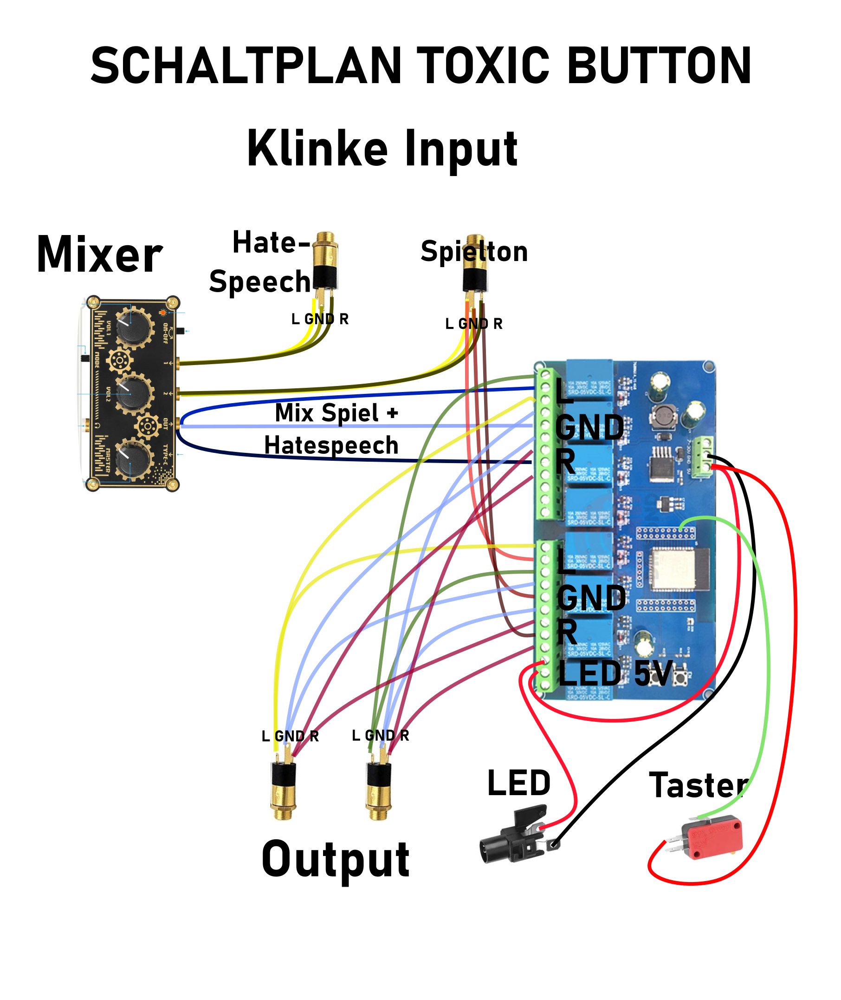
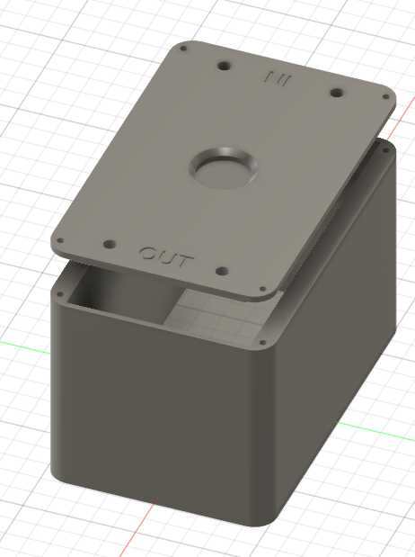

# AudioBox - Hass-Schalter / Toxic-Button

## Station: Hass-Schalter / Toxic-Button

**Ziel:**  
Die Teilnehmenden erleben durch ein interaktives Setting die emotionale Wirkung von toxischer Kommunikation und reflektieren, welche Verantwortung sie im digitalen Raum tragen. Die Station macht deutlich, wie leicht verletzende Worte „weitergegeben“ werden – und welche Auswirkungen das auf die Beteiligten haben kann.

**Ablauf:**  
- Zwei Personen spielen gemeinsam ein Spiel an einer Konsole. Beide tragen Kopfhörer und hören die reguläre Spielmusik und Soundeffekte.
- Eine der beiden Personen bekommt zusätzlich über einen Audiokanal beleidigende Sprachkommentare zugespielt. Sie hat die Möglichkeit, diese per Knopfdruck an die andere Person „weiterzugeben“ und selbst nur noch die Musik zu hören.
- Nach einer Spielrunde folgt eine moderierte Reflexion:  
  - Wie hat sich das Erlebnis angefühlt?  
  - Warum wurde der Knopf gedrückt – oder nicht?  
  - Was bedeutet Verantwortung in einer digitalen Kommunikation?

**Technische Umsetzung:**  
Der Toxic Button ist ein Schalter, der auf Knopfdruck zwei Soundspuren tauscht. Nach dem Tausch ist ein erneutes Tauschen erst nach einem zufälligen Zeitintervall zwischen einer und fünf Sekunden möglich. Sobald das Zeitintervall abgelaufen ist, leuchtet die LED im Taster. Realisiert wurde dies mit:
- Einem 2 Kanal Mixer
- Einem Leuchttaster
- Vier Klinke Buchsen
- Einem ESP32-Modul mit 8 Relais

## Schaltplan

## Gehäuse

## Bauteile

### 8-Relay-Module
Kann in Suchmaschinen unter der Bezeichnung "ESP32 8 Relay Module" gefunden werden.

[Google-Suche](https://www.google.com/search?q=ESP32+8+Relay+Module)
[Amazon](https://www.amazon.de/-/en/8-channel-wireless-control-development-controlling/dp/B0CCSF1WNH)

### Arcade-LED-Button
[Amazon](https://www.amazon.de/dp/B01LZMANZ7?ref=ppx_yo2ov_dt_b_fed_asin_title&th=1)

### Klinke Buchsen
[Amazon](https://www.amazon.de/dp/B07TT16XJV?ref=ppx_yo2ov_dt_b_fed_asin_title)

### 2 Kanal Mixer
[Amazon](https://www.amazon.de/dp/B09TT3LVGX?ref=ppx_yo2ov_dt_b_fed_asin_title)
